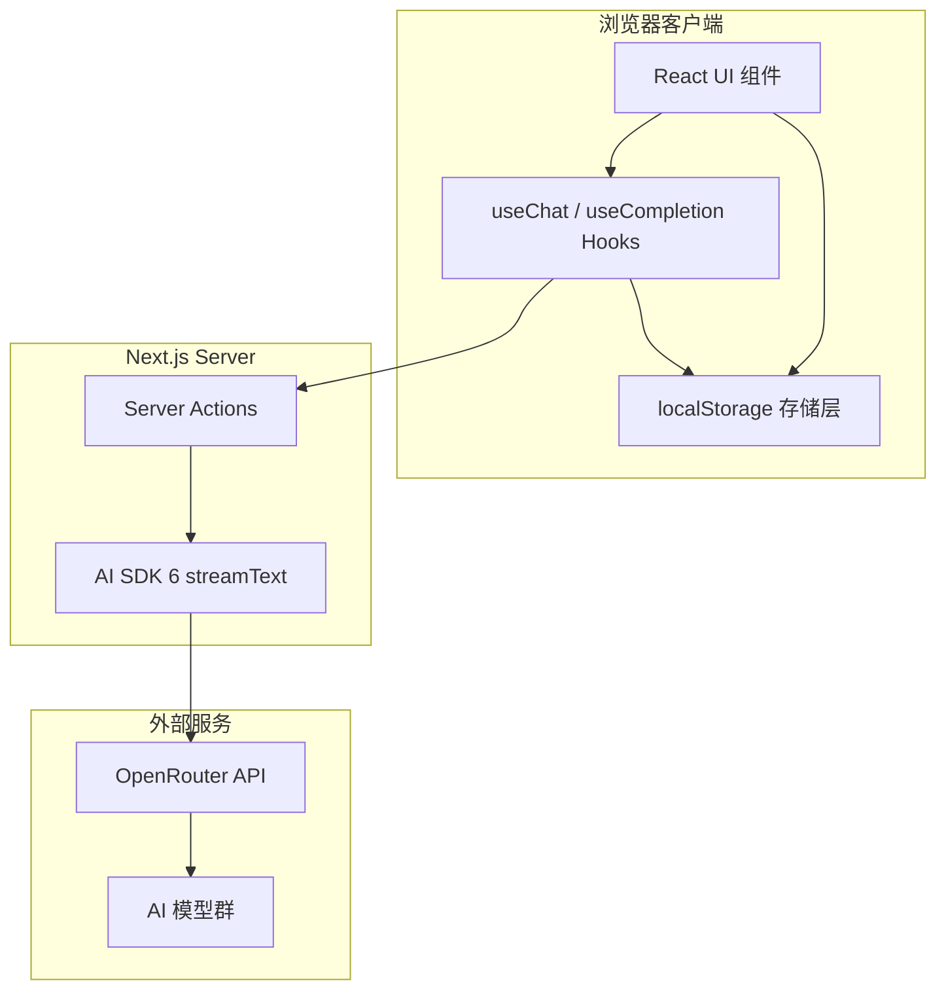
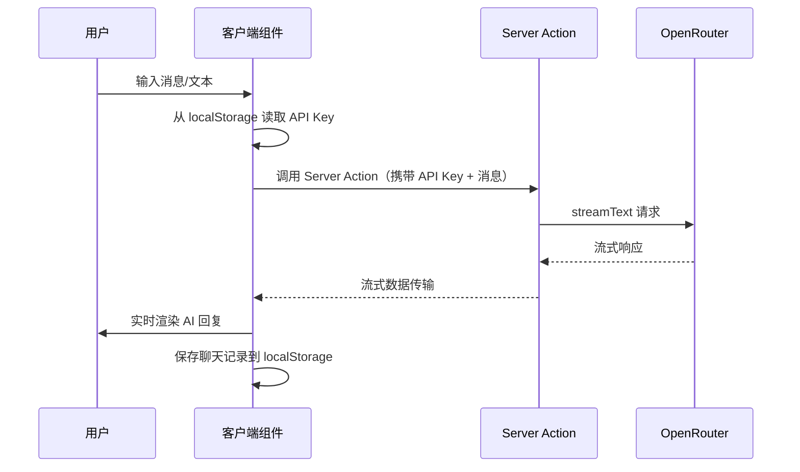
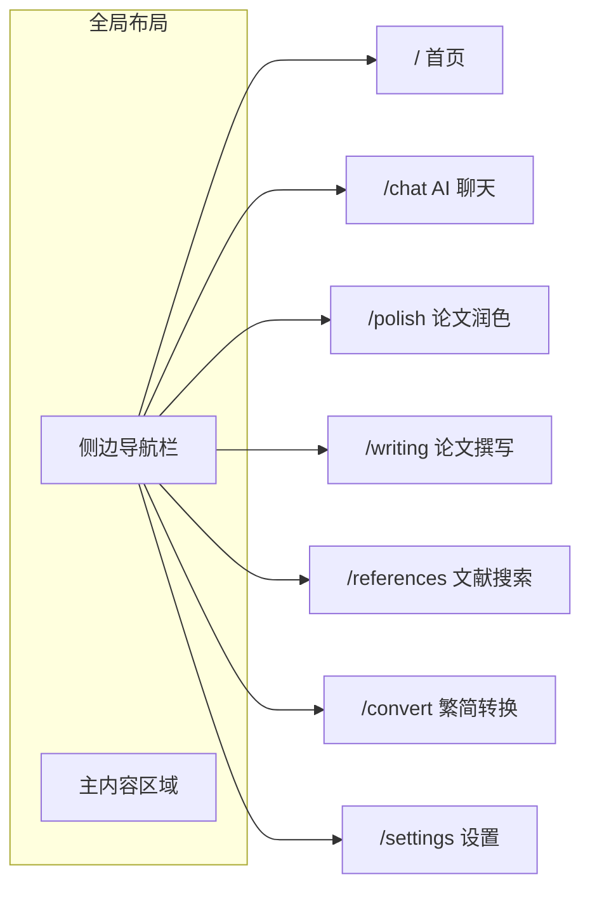

# PhD-Doc 产品规格文档

## 1. 项目概述

PhD-Doc 是一个面向地质专业研究人员的 AI 辅助工具平台，核心聚焦于**扬子克拉通（Yangtze Craton）**研究方向，特别涉及**庙湾变质超基性岩（Miaowan Metamorphosed Ultramafic Rocks）**、**新元古代初始俯冲（Neoproterozoic Subduction Initiation）**、**锆石 U-Pb 定年（Zircon U-Pb Dating）**、**Re-Os 同位素体系（Re-Os Isotope System）**以及 **Rodinia 超大陆聚合（Rodinia Supercontinent Assembly）**等关键研究领域。平台集成多种 AI 驱动的实用功能，帮助研究人员提升论文撰写、翻译润色和日常科研工作效率。

用户通过提供自己的 [OpenRouter](https://openrouter.ai/) API Key 来访问平台提供的所有 AI 功能，无需后端账户系统，所有数据存储于浏览器 localStorage 中。

### 1.1 研究背景

本项目服务的核心学术方向为扬子克拉通地区的地质研究，关键研究主题包括：

- **扬子克拉通（Yangtze Craton）**: 华南板块的重要组成部分，前寒武纪基底与构造演化研究的关键区域
- **庙湾变质超基性岩（Miaowan Metamorphosed Ultramafic Rocks）**: 记录了新元古代早期俯冲-增生过程的关键岩石单元
- **新元古代初始俯冲（Neoproterozoic Subduction Initiation）**: 扬子克拉通北缘新元古代洋内/洋陆俯冲的启动过程，与 Rodinia 超大陆聚合密切相关
- **锆石 U-Pb 定年（Zircon U-Pb Dating）**: 精确限定岩石形成年龄与构造事件时限的关键年代学方法
- **Re-Os 同位素（Re-Os Isotope）**: 示踪超基性岩地幔源区特征、壳幔相互作用及成岩年龄的重要工具
- **Rodinia 超大陆聚合（Rodinia Supercontinent Assembly）**: 新元古代早期全球板块汇聚过程，扬子克拉通在其中的位置与角色

### 1.2 目标用户

- 地质学、岩石学、地球化学方向的研究生及科研人员
- 从事扬子克拉通及变质超基性岩、俯冲带相关课题研究的学者
- 需要中英文学术写作辅助的地质专业人员

### 1.3 核心价值

- 内置扬子克拉通、变质超基性岩、初始俯冲等方向的专业领域知识 AI 助手
- 学术论文中英翻译与润色，确保变质超基性岩、同位素定年、俯冲起始等专业术语准确
- 繁简中文转换，方便处理港台地区文献资料
- 零后端架构，用户数据完全本地化，保护隐私

---

## 2. 技术栈

| 类别 | 技术选型 | 版本/说明 |
|------|---------|----------|
| 框架 | Next.js (App Router) | 15.x |
| AI SDK | Vercel AI SDK | 6.x |
| AI 提供商 | OpenRouter | 通过 `@openrouter/ai-sdk-provider` |
| UI 框架 | Tailwind CSS | 4.x |
| 组件库 | shadcn/ui | 最新版 |
| 繁简转换 | OpenCC (JavaScript) | `opencc-js` |
| 数据存储 | localStorage | 浏览器原生 API |
| 语言 | TypeScript | 5.x |
| 包管理 | pnpm | 最新版 |

---

## 3. 系统架构



### 3.1 数据流



---

## 4. 功能模块

### 4.1 API Key 管理

**路由**: `/settings`

**功能描述**:  
用户首次使用时需要配置 OpenRouter API Key。Key 存储在 localStorage 中，后续所有 AI 功能调用时从本地读取。

**详细需求**:
- 提供 API Key 输入框，支持密码模式显示/隐藏切换
- Key 输入后进行格式校验（OpenRouter Key 格式为 `sk-or-v1-` 前缀）
- 提供「验证」按钮，调用 OpenRouter API 验证 Key 有效性
- 验证成功后保存到 localStorage，显示成功提示
- 提供「清除 Key」功能
- 页面显示当前 Key 的状态（已配置/未配置）
- 未配置 Key 时，其他功能页面应显示引导提示，引导用户前往设置页

**localStorage Key**: `phd-doc:api-key`

---

### 4.2 AI 聊天

**路由**: `/chat`

**功能描述**:  
基础的 AI 对话功能，内置扬子克拉通方向的地质专业系统提示词，帮助用户进行专业问题讨论。

**详细需求**:
- 使用 AI SDK 6 的 `useChat` hook + Server Action 实现流式对话
- 内置系统提示词（System Prompt），预设地质学专业角色：
  ```
  你是一位资深的地质学研究专家，专注于扬子克拉通的构造演化研究。
  你的专业领域包括但不限于：
  - 扬子克拉通的前寒武纪基底地质与构造演化
  - 庙湾变质超基性岩的岩石学、矿物学与地球化学特征
  - 新元古代初始俯冲（subduction initiation）过程与机制
  - 锆石 U-Pb 定年方法与年代学解释
  - Re-Os 同位素体系在超基性岩成岩年龄和地幔源区示踪中的应用
  - 变质超基性岩（蛇纹岩、滑石岩等）的变质作用与原岩恢复
  - Rodinia 超大陆聚合过程及扬子克拉通的构造位置
  - 俯冲带岩浆作用与壳幔相互作用
  请用专业但易于理解的方式回答问题，必要时引用相关文献和研究成果。
  ```
- 支持多轮对话，上下文保持
- 消息列表支持 Markdown 渲染（代码块、表格、公式等）
- 支持新建对话 / 切换历史对话
- 聊天记录保存到 localStorage
- 用户可选择 OpenRouter 提供的不同模型进行对话
- 显示消息发送时间戳
- 支持停止生成按钮

**localStorage Key**: `phd-doc:chat-sessions`

**数据结构**:
```typescript
interface ChatSession {
  id: string;
  title: string;
  model: string;
  messages: Message[];
  createdAt: number;
  updatedAt: number;
}
```

---

### 4.3 论文润色与翻译（Agent 模式）

**路由**: `/polish`

**功能描述**:  
提供学术论文的中文转英文翻译与润色功能，采用 Agent 工作流确保翻译质量。特别针对地质学术语进行优化。支持**多模型并行生成对比**，并通过独立的 **Editor（评审 Agent）** 对各模型结果进行评分与点评，帮助用户选出最优翻译。

**详细需求**:

#### 基础功能
- 左侧输入中文原文，右侧以标签页/卡片形式展示多个模型的润色结果
- Agent 工作流分为三个阶段：
  1. **翻译阶段**: 将中文学术文本翻译为英文
  2. **润色阶段**: 对翻译结果进行学术风格润色，优化表达、语法和术语
  3. **评审阶段（Editor）**: 独立 AI 评审 Agent 对各模型润色结果进行打分和点评
- 内置地质学术语表，确保关键术语翻译准确，例如：
  - 扬子克拉通 → Yangtze Craton
  - 黄陵穹隆 → Huangling Dome
  - 庙湾变质超基性岩 → Miaowan metamorphosed ultramafic rocks
  - 超基性岩 → ultramafic rock
  - 变质超基性岩 → metamorphosed ultramafic rock
  - 橄榄岩 → peridotite
  - 辉石岩 → pyroxenite
  - 蛇纹岩 → serpentinite
  - 蛇纹石化 → serpentinization
  - 滑石 → talc
  - 铬铁矿 → chromite
  - 初始俯冲 → subduction initiation
  - 俯冲起始 → subduction initiation
  - 洋内俯冲 → intra-oceanic subduction
  - Rodinia 超大陆聚合 → Rodinia supercontinent assembly
  - 锆石 U-Pb 定年 → zircon U-Pb dating
  - Re-Os 同位素 → Re-Os isotope
  - 模式年龄 → model age
  - 等时线年龄 → isochron age
  - 前寒武纪 → Precambrian
  - 新元古代 → Neoproterozoic
  - 变质岩 → metamorphic rock
  - 沉积盆地 → sedimentary basin
  - 岩浆作用 → magmatism
  - 地球化学 → geochemistry
  - 壳幔相互作用 → crust-mantle interaction
  - 亏损地幔 → depleted mantle
  - 俯冲带 → subduction zone
  - Rodinia 超大陆 → Rodinia supercontinent
  - 弧前 → forearc
  - 岛弧 → island arc
  - SSZ 型 → supra-subduction zone (SSZ) type
- 流式输出润色结果
- 支持段落级别输入（适合论文逐段润色）
- 提供「复制结果」按钮
- 保存润色历史记录到 localStorage

#### 多模型对比生成
- 用户可从预设模型列表中勾选 2~4 个模型同时生成翻译/润色结果
- 各模型的请求**并行发起**，独立流式输出
- 右侧结果区以标签页切换或纵向卡片排列展示各模型的输出
- 每张卡片显示：模型名称、生成状态（生成中/已完成）、润色结果文本
- 支持对单个模型结果「复制」或「采纳为最终版本」

#### Editor 评审 Agent
- 所有模型润色结果生成完毕后，自动触发 Editor Agent 进行评审（用户也可手动触发）
- Editor 使用一个独立的高能力模型（默认使用用户在设置中选择的评审模型）
- Editor 输出结构化评分：

| 评分维度 | 说明 |
|---------|------|
| 术语准确性 (Terminology) | 地质学专业术语翻译是否准确 |
| 学术规范性 (Academic Style) | 是否符合学术论文写作规范 |
| 语言流畅度 (Fluency) | 英文表达是否自然流畅 |
| 忠实度 (Faithfulness) | 是否忠实传达原文含义，无遗漏或曲解 |
| 综合评分 (Overall) | 1-10 分综合打分 |

- 每个模型结果获得独立的评分卡，包含各维度分数（1-10）和简要点评
- 评分结果以可视化方式展示（分数条/雷达图）
- Editor 还会输出一段总结性推荐，说明最佳结果及理由

**System Prompt（翻译阶段）**:
```
你是一位地质学领域的专业学术翻译，擅长将中文地质学论文翻译为高质量的英文学术文本。
你尤其熟悉扬子克拉通、庙湾变质超基性岩、新元古代初始俯冲、锆石 U-Pb 定年、Re-Os 同位素和 Rodinia 超大陆聚合等研究方向。
翻译要求：
1. 准确使用地质学专业术语，特别是变质超基性岩岩石学、俯冲带地质和同位素年代学领域的术语
2. 保持学术写作风格，语言正式、客观
3. 确保句式结构符合英文学术论文规范（如 Earth-Science Reviews, Precambrian Research 等期刊风格）
4. 保留原文中的数据、引用标记和图表编号
```

**System Prompt（润色阶段）**:
```
你是一位英文学术论文润色专家，专注于地球科学领域。
请对以下翻译后的英文文本进行润色：
1. 优化句式结构和段落衔接
2. 确保使用学术英语的被动语态和正式表达
3. 检查并修正语法错误
4. 提升文本的可读性和逻辑连贯性
5. 确保专业术语使用的一致性
```

**System Prompt（评审 Editor）**:
```
你是一位资深的地球科学领域学术期刊编辑和审稿人。
请对以下多个模型生成的英文学术翻译/润色结果进行独立评审。

评审维度及评分标准（每项 1-10 分）：
1. 术语准确性 (Terminology): 变质超基性岩、初始俯冲、同位素定年等专业术语是否翻译准确、一致
2. 学术规范性 (Academic Style): 是否符合国际地质学期刊（Precambrian Research, Lithos 等）的写作规范
3. 语言流畅度 (Fluency): 英文表达是否自然、地道，无生硬翻译痕迹
4. 忠实度 (Faithfulness): 是否完整、准确地传达了原文含义

请对每个模型的结果分别评分，给出各维度分数和简要点评，
最后给出综合评分和推荐意见。

输出格式要求：严格使用 JSON 格式输出。
```

**Editor 输出结构**:
```typescript
interface EditorReview {
  modelReviews: {
    model: string;
    scores: {
      terminology: number;
      academicStyle: number;
      fluency: number;
      faithfulness: number;
      overall: number;
    };
    comment: string;
  }[];
  recommendation: string;
}
```

**localStorage Key**: `phd-doc:polish-history`

**数据结构**:
```typescript
interface PolishResult {
  model: string;
  translatedText: string;
  polishedText: string;
  review?: {
    scores: {
      terminology: number;
      academicStyle: number;
      fluency: number;
      faithfulness: number;
      overall: number;
    };
    comment: string;
  };
}

interface PolishRecord {
  id: string;
  sourceText: string;
  selectedModels: string[];
  results: PolishResult[];
  editorModel: string;
  recommendation: string;
  createdAt: number;
}
```

---

### 4.4 论文讨论与撰写

**路由**: `/writing`

**功能描述**:  
辅助用户撰写论文的特定章节，特别是讨论（Discussion）部分。AI 基于用户提供的研究数据和发现，生成学术风格的讨论段落。

**详细需求**:
- 提供多种写作模板/模式选择：
  - **讨论（Discussion）**: 基于研究结果进行分析讨论
  - **引言（Introduction）**: 研究背景和目的撰写
  - **摘要（Abstract）**: 论文摘要生成
  - **结论（Conclusion）**: 研究结论总结
  - **自由撰写**: 无模板约束的自由写作辅助
- 用户输入关键信息：
  - 研究发现/数据摘要
  - 参考文献要点（可选）
  - 写作要求/方向说明
- AI 生成对应章节的草稿，流式输出
- 生成结果支持 Markdown 渲染
- 提供「继续扩展」功能（对已生成内容追加内容）
- 提供「修改建议」功能（对已生成内容提出修改方向，重新生成）
- 支持中英文输出切换
- 保存撰写历史

**System Prompt**:
```
你是一位地质学领域的学术写作助手，专注于扬子克拉通的构造演化研究。
你的核心知识领域包括：庙湾变质超基性岩、新元古代初始俯冲、锆石 U-Pb 年代学、Re-Os 同位素地球化学，
以及 Rodinia 超大陆聚合过程中扬子克拉通的构造响应。
你的任务是帮助研究人员撰写高质量的学术论文章节。
写作要求：
1. 严格遵循国际地质学期刊（如 Precambrian Research, Lithos, GSAB 等）的写作规范
2. 论点清晰，逻辑严密，数据论证充分
3. 合理引用和讨论前人研究成果，特别是扬子克拉通变质超基性岩和初始俯冲相关的经典文献
4. 使用准确的地质学专业术语，确保与国际学术界接轨
5. 根据用户指定的章节类型调整写作风格和结构
```

**localStorage Key**: `phd-doc:writing-history`

**数据结构**:
```typescript
interface WritingRecord {
  id: string;
  mode: 'discussion' | 'introduction' | 'abstract' | 'conclusion' | 'free';
  inputSummary: string;
  references: string;
  requirements: string;
  outputLanguage: 'zh' | 'en';
  generatedText: string;
  model: string;
  createdAt: number;
  updatedAt: number;
}
```

---

### 4.5 繁简转换

**路由**: `/convert`

**功能描述**:  
提供繁体中文到简体中文的转换工具，方便处理港台地区地质文献资料。使用 `opencc-js` 库进行纯前端转换，无需调用 AI 接口。

**详细需求**:
- 左右双栏布局：左侧输入繁体中文，右侧显示简体中文结果
- 使用 `opencc-js` 进行转换，支持以下转换模式：
  - 繁体中文（台湾）→ 简体中文
  - 繁体中文（香港）→ 简体中文
  - 简体中文 → 繁体中文（台湾）（反向转换）
- 输入即转换（实时转换，无需点击按钮）
- 支持粘贴大段文本
- 提供「复制结果」按钮
- 提供「清空」按钮
- 显示字符统计
- 纯前端实现，无需 API Key

---

### 4.6 参考文献搜索与生成

**路由**: `/references`

**功能描述**:  
帮助用户搜索与研究课题相关的参考文献，并基于研究方向 AI 生成潜在的相关文献推荐列表。包含两种模式：**文献搜索**（基于关键词查找已有文献）和**文献推荐生成**（AI 根据研究主题生成可能相关的文献线索）。

> **重要提示**: AI 生成的文献推荐可能包含虚构条目（hallucination），系统会在 UI 中明确标注提醒用户自行核实。

**详细需求**:

#### 文献搜索模式
- 用户输入研究关键词（中文或英文），AI 结合 web search 能力搜索相关学术文献
- 支持输入多个关键词/短语，用逗号或换行分隔
- 提供预设关键词快捷按钮（基于项目核心研究方向）：
  - Yangtze Craton ultramafic
  - Miaowan metamorphosed ultramafic
  - Neoproterozoic subduction initiation
  - Re-Os isotope ultramafic
  - Zircon U-Pb Neoproterozoic Yangtze
  - Rodinia assembly South China
- 搜索结果以卡片列表展示，每条包含：标题、作者、期刊、年份、摘要（如有）、DOI 链接
- 支持将文献条目「收藏」到本地文献库
- 支持「复制引用」按钮（输出 APA / GB/T 7714 格式）

#### 文献推荐生成模式
- 用户输入研究主题描述或粘贴论文段落，AI 生成该方向下可能相关的文献列表
- AI 会基于领域知识推荐经典文献和近年重要研究，包含：
  - 文献的标题、可能的作者和期刊
  - 该文献与用户研究主题的关联说明
  - 推荐理由（为什么这篇文献对用户的研究有价值）
- 生成结果带有明显的「AI 生成，请核实」警示标识
- 用户可对生成结果进行「标记已验证」操作
- 支持将推荐文献批量导出为文本列表

#### 本地文献库
- 用户收藏的文献和已验证的推荐文献统一管理
- 支持按关键词搜索本地文献库
- 支持删除和编辑文献条目
- 数据保存到 localStorage

**System Prompt（文献搜索）**:
```
你是一位地球科学领域的学术文献检索助手。
用户将提供研究关键词，请帮助搜索和整理相关的学术文献。
重点关注以下研究方向的文献：
- 扬子克拉通构造演化
- 变质超基性岩（特别是庙湾地区）
- 新元古代初始俯冲与大地构造
- 锆石 U-Pb 年代学和 Re-Os 同位素地球化学
- Rodinia 超大陆聚合

请尽可能提供准确的文献信息（标题、作者、期刊、年份、DOI）。
如果无法确认某条信息，请明确标注为"待核实"。
```

**System Prompt（文献推荐）**:
```
你是一位扬子克拉通和前寒武纪地质研究领域的资深学者。
根据用户提供的研究主题，推荐该方向下的重要学术文献。

推荐原则：
1. 优先推荐该领域的经典文献和高被引论文
2. 兼顾近 5 年的重要新进展
3. 覆盖不同研究角度（岩石学、地球化学、年代学、构造学）
4. 每条推荐说明与用户研究的具体关联

注意：你推荐的文献信息可能不完全准确，请在每条建议中标注置信度（高/中/低），
置信度高表示你非常确定该文献存在且信息准确，低表示该方向可能有相关研究但具体信息需要用户核实。
```

**localStorage Key**: `phd-doc:references`

**数据结构**:
```typescript
interface Reference {
  id: string;
  title: string;
  authors: string;
  journal: string;
  year: string;
  doi: string;
  abstract: string;
  source: 'search' | 'ai-generated';
  verified: boolean;
  confidence?: 'high' | 'medium' | 'low';
  relevance: string;
  createdAt: number;
}

interface ReferenceSearchRecord {
  id: string;
  keywords: string[];
  mode: 'search' | 'recommend';
  inputText: string;
  results: Reference[];
  model: string;
  createdAt: number;
}
```

---

## 5. 页面结构与路由



### 5.1 路由清单

| 路由 | 页面名称 | 说明 | 需要 API Key |
|------|---------|------|:----------:|
| `/` | 首页 | 功能导航卡片，项目介绍 | 否 |
| `/chat` | AI 聊天 | 多轮对话，专业问答 | 是 |
| `/polish` | 论文润色 | 中英翻译 + 学术润色 | 是 |
| `/writing` | 论文撰写 | 章节辅助写作 | 是 |
| `/references` | 文献搜索 | 文献检索 + AI 推荐 | 是 |
| `/convert` | 繁简转换 | 繁体/简体中文互转 | 否 |
| `/settings` | 设置 | API Key 管理 | 否 |

### 5.2 全局布局

- **侧边导航栏**: 固定在左侧，包含各功能页面的导航链接和图标，底部显示设置入口
- **顶部栏**: 显示当前页面标题，API Key 状态指示器
- **主内容区域**: 各功能页面的具体内容
- **响应式设计**: 移动端侧边栏可折叠为汉堡菜单

---

## 6. 数据模型

所有数据存储于浏览器 localStorage，使用统一的前缀 `phd-doc:` 避免键名冲突。

### 6.1 存储键清单

| localStorage Key | 数据类型 | 说明 |
|-----------------|---------|------|
| `phd-doc:api-key` | `string` | OpenRouter API Key |
| `phd-doc:chat-sessions` | `ChatSession[]` | 聊天会话列表 |
| `phd-doc:polish-history` | `PolishRecord[]` | 润色历史记录 |
| `phd-doc:writing-history` | `WritingRecord[]` | 撰写历史记录 |
| `phd-doc:references` | `Reference[]` | 本地文献库 |
| `phd-doc:reference-searches` | `ReferenceSearchRecord[]` | 文献搜索/推荐历史 |
| `phd-doc:preferences` | `UserPreferences` | 用户偏好设置 |

### 6.2 类型定义

```typescript
// 用户偏好
interface UserPreferences {
  defaultModel: string;
  theme: 'light' | 'dark' | 'system';
  language: 'zh-CN' | 'en';
}

// 聊天会话
interface ChatSession {
  id: string;                // UUID
  title: string;             // 会话标题（取自首条消息摘要）
  model: string;             // 使用的模型标识
  messages: Message[];       // AI SDK Message 类型
  createdAt: number;         // 创建时间戳
  updatedAt: number;         // 最后更新时间戳
}

// 润色记录
interface PolishRecord {
  id: string;
  sourceText: string;        // 中文原文
  translatedText: string;    // 翻译结果
  polishedText: string;      // 润色结果
  model: string;
  createdAt: number;
}

// 文献条目
interface Reference {
  id: string;
  title: string;               // 文献标题
  authors: string;              // 作者
  journal: string;              // 期刊名
  year: string;                 // 发表年份
  doi: string;                  // DOI 链接
  abstract: string;             // 摘要
  source: 'search' | 'ai-generated';  // 来源方式
  verified: boolean;            // 是否已人工验证
  confidence?: 'high' | 'medium' | 'low';  // AI 推荐置信度
  relevance: string;            // 与研究的关联说明
  createdAt: number;
}

// 撰写记录
interface WritingRecord {
  id: string;
  mode: 'discussion' | 'introduction' | 'abstract' | 'conclusion' | 'free';
  inputSummary: string;      // 用户输入的研究摘要
  references: string;        // 参考文献要点
  requirements: string;      // 写作要求
  outputLanguage: 'zh' | 'en';
  generatedText: string;     // 生成的文本
  model: string;
  createdAt: number;
  updatedAt: number;
}
```

### 6.3 localStorage 工具函数

提供统一的存储操作封装：

```typescript
// lib/storage.ts
const STORAGE_PREFIX = 'phd-doc:';

function getItem<T>(key: string): T | null;
function setItem<T>(key: string, value: T): void;
function removeItem(key: string): void;
```

---

## 7. AI 集成架构

### 7.1 OpenRouter 接入

通过 `@openrouter/ai-sdk-provider` 包接入 OpenRouter，在 Server Action 中动态创建 provider 实例：

```typescript
// lib/ai.ts
import { createOpenRouter } from '@openrouter/ai-sdk-provider';

export function createProvider(apiKey: string) {
  return createOpenRouter({ apiKey });
}
```

### 7.2 Server Actions

每个 AI 功能模块对应一个 Server Action 文件：

```
app/
├── chat/
│   └── actions.ts          # 聊天 Server Action
├── polish/
│   └── actions.ts          # 润色 Server Action
├── writing/
│   └── actions.ts          # 撰写 Server Action
```

Server Action 接收客户端传来的 API Key 和消息，调用 AI SDK 6 的 `streamText` 返回流式响应：

```typescript
'use server';

import { streamText } from 'ai';
import { createProvider } from '@/lib/ai';

export async function chat(apiKey: string, messages: Message[], model: string) {
  const provider = createProvider(apiKey);

  const result = streamText({
    model: provider(model),
    system: GEOLOGY_SYSTEM_PROMPT,
    messages,
  });

  return result.toUIMessageStreamResponse();
}
```

### 7.3 推荐模型列表

在 UI 中提供以下预设模型供用户选择（通过 OpenRouter 访问）：

| 模型 | 标识 | 适用场景 |
|------|------|---------|
| GPT-4o | `openai/gpt-4o` | 通用对话、论文撰写 |
| Claude 3.5 Sonnet | `anthropic/claude-3.5-sonnet` | 长文本处理、润色 |
| Gemini 2.0 Flash | `google/gemini-2.0-flash-001` | 快速响应、日常问答 |
| DeepSeek V3 | `deepseek/deepseek-chat` | 中文理解、性价比 |
| Qwen 2.5 72B | `qwen/qwen-2.5-72b-instruct` | 中文学术写作 |

用户也可输入任意 OpenRouter 支持的模型标识。

---

## 8. 项目目录结构

```
phd-doc/
├── app/
│   ├── layout.tsx                 # 全局布局（侧边栏 + 主内容）
│   ├── page.tsx                   # 首页
│   ├── chat/
│   │   ├── page.tsx               # 聊天页面
│   │   └── actions.ts             # 聊天 Server Action
│   ├── polish/
│   │   ├── page.tsx               # 润色页面
│   │   └── actions.ts             # 润色 Server Action
│   ├── writing/
│   │   ├── page.tsx               # 撰写页面
│   │   └── actions.ts             # 撰写 Server Action
│   ├── references/
│   │   ├── page.tsx               # 文献搜索页面
│   │   └── actions.ts             # 文献搜索/推荐 Server Action
│   ├── convert/
│   │   └── page.tsx               # 繁简转换页面（纯前端）
│   └── settings/
│       └── page.tsx               # 设置页面
├── components/
│   ├── layout/
│   │   ├── sidebar.tsx            # 侧边导航栏
│   │   └── header.tsx             # 顶部栏
│   ├── chat/
│   │   ├── chat-input.tsx         # 聊天输入框
│   │   ├── chat-messages.tsx      # 消息列表
│   │   └── message-bubble.tsx     # 单条消息气泡
│   ├── polish/
│   │   ├── source-editor.tsx      # 原文输入区
│   │   └── result-panel.tsx       # 结果展示区
│   ├── writing/
│   │   ├── mode-selector.tsx      # 写作模式选择器
│   │   ├── input-form.tsx         # 输入表单
│   │   └── output-panel.tsx       # 输出面板
│   ├── references/
│   │   ├── search-form.tsx        # 搜索/推荐输入表单
│   │   ├── reference-card.tsx     # 文献卡片组件
│   │   └── reference-library.tsx  # 本地文献库组件
│   ├── convert/
│   │   └── converter.tsx          # 转换器组件
│   └── ui/                        # shadcn/ui 组件
│       ├── button.tsx
│       ├── input.tsx
│       ├── textarea.tsx
│       ├── card.tsx
│       ├── select.tsx
│       └── ...
├── lib/
│   ├── ai.ts                      # OpenRouter provider 工厂
│   ├── storage.ts                 # localStorage 工具函数
│   ├── prompts.ts                 # 系统提示词集合
│   └── models.ts                  # 模型列表配置
├── hooks/
│   ├── use-api-key.ts             # API Key 管理 hook
│   └── use-local-storage.ts       # localStorage hook
├── types/
│   └── index.ts                   # 全局类型定义
├── public/
├── tailwind.config.ts
├── tsconfig.json
├── next.config.ts
├── package.json
└── SPEC.md
```

---

## 9. UI/UX 设计规范

### 9.1 设计原则

- **简洁专业**: 学术工具风格，避免过多装饰
- **高效操作**: 减少操作步骤，核心功能一步直达
- **清晰反馈**: 所有 AI 操作提供加载状态和流式输出视觉反馈
- **响应式**: 支持桌面和平板设备

### 9.2 配色方案

- 主色调: 深蓝/靛蓝色系（体现学术严谨）
- 辅助色: 琥珀色（用于强调和 CTA）
- 支持 Light/Dark 主题切换

### 9.3 关键交互

- AI 生成过程中显示打字机效果（流式输出）
- 长文本输入区域支持自适应高度
- 复制按钮提供操作成功的 Toast 反馈
- API Key 未配置时全局 Banner 提示

---

## 10. 非功能性需求

### 10.1 性能

- 首屏加载时间 < 2 秒
- AI 流式响应首字节延迟取决于 OpenRouter 网络，前端不应引入额外延迟
- localStorage 读写操作异步化，避免阻塞 UI 线程

### 10.2 安全

- API Key 仅存储在用户本地 localStorage，不上传至任何服务器
- Server Action 中 API Key 通过请求体传递，不记录日志
- 不收集任何用户数据

### 10.3 兼容性

- 支持 Chrome、Firefox、Safari、Edge 最新两个主要版本
- 最低屏幕宽度支持: 768px（平板）

---

## 11. 开发阶段规划

### Phase 1: 基础框架搭建
- Next.js 项目初始化
- Tailwind CSS + shadcn/ui 配置
- 全局布局（侧边栏 + 主内容区）
- 路由页面骨架
- localStorage 工具层

### Phase 2: 核心功能 - 设置与聊天
- API Key 管理功能
- AI SDK 6 + OpenRouter 集成
- AI 聊天功能完整实现

### Phase 3: 扩展功能 - 润色与撰写
- 论文润色/翻译 Agent 工作流
- 论文撰写辅助功能

### Phase 4: 文献与工具
- 参考文献搜索功能
- AI 文献推荐生成功能
- 本地文献库管理
- 繁简转换功能
- 首页导航卡片
- UI 细节打磨与响应式优化
- Dark/Light 主题支持
